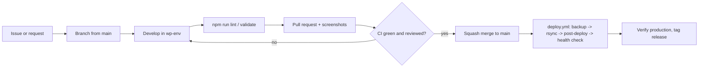

# SDLC and CI/CD for egi-optics.com

Long form of `.cursor/rules/wordpress-sdlc-cicd.mdc`. Everything here uses free tooling only:
Docker + `@wordpress/env`, GitHub Actions (free minutes for public repositories), WP-CLI, rsync, SSH.

## 1. Environments

| Environment | Location                                                  | Data                         | Who changes it                                 |
| ----------- | --------------------------------------------------------- | ---------------------------- | ---------------------------------------------- |
| local       | `wp-env` container, http://localhost:8888                 | seed content (`npm run env:seed`) or a sanitised import | every developer                     |
| production  | Hostinger, `~/domains/egi-optics.com/public_html`         | live database + uploads      | `deploy.yml` (code) · editors in wp-admin (content) · reviewed WP-CLI scripts |

Staging is intentionally out of scope for now (see plan); consequently every production deploy is
**backup-first** and PRs must carry local screenshots. When a staging site is added
(`staging.egi-optics.com`), the `develop` branch will deploy there using the same workflow with a second
set of secrets.

### Local environment

```bash
composer install     # PHP tooling + third-party plugins (wpackagist) into wp-content/plugins
npm install          # @wordpress/env, @wordpress/scripts
npm run env:start    # WordPress + MariaDB in Docker, theme/plugin bind-mounted
npm run env:seed     # creates demo products, pages, menus and a news post
```

Credentials: `admin` / `password`. `WP_DEBUG` and `SCRIPT_DEBUG` are on, `WP_ENVIRONMENT_TYPE=local`.

## 2. Lifecycle of a change



## 3. Quality gates (CI)

`ci.yml` runs on every pull request and on pushes to `main`:

| Step                 | Tool                                                     | Why                                                   |
| -------------------- | -------------------------------------------------------- | ----------------------------------------------------- |
| PHP syntax           | `php-parallel-lint` on PHP 8.2                           | fatal errors never reach the server                   |
| Coding standards     | PHPCS with WordPress-Extra, WordPress-Docs, PHPCompatibilityWP | security sniffs (escaping, nonces), WP APIs, PHP 8.2 compatibility |
| CSS                  | stylelint (`@wordpress/stylelint-config`)                | consistent, valid CSS                                 |
| JS                   | eslint (`@wordpress/eslint-plugin`)                      | browser-safe, no unused code                          |
| JSON                 | `scripts/dev/validate-json.mjs`                          | `theme.json` / `block.json` cannot break global styles |

A PR cannot be merged while any check is red (branch protection).

## 4. Delivery (CD)

`deploy.yml` runs on push to `main` (and manually via *Run workflow* for rollbacks):

1. **Backup** - `scripts/server/backup.sh` executed over SSH: database dump (`mysqldump | gzip`) plus a
   tarball of the theme and plugin currently in production, stored in `~/backups/egi-optics/<UTC timestamp>/`.
   The last 10 backups are kept.
2. **Sync code** - `rsync -az --delete` of `wp-content/themes/egi-optics/` and
   `wp-content/plugins/egi-optics-core/` only. `.rsync-exclude` strips dev files (`node_modules`, tests,
   dotfiles). Nothing else in `public_html` is touched.
3. **Post-deploy** - `scripts/server/post-deploy.sh`: ensure the theme and plugin are active, flush
   rewrite rules, flush the object cache, purge LiteSpeed, print versions.
4. **Health check** - HTTP 200 required for `/`, `/products/`, `/news/`; otherwise the job fails and the
   run is red in GitHub so the on-call developer can roll back.

Required repository secrets:

| Secret               | Value                                                   |
| -------------------- | ------------------------------------------------------- |
| `HOSTINGER_SSH_KEY`  | private key of the dedicated deploy key (ed25519)       |
| `HOSTINGER_HOST`     | `147.93.99.109`                                         |
| `HOSTINGER_PORT`     | `65002`                                                 |
| `HOSTINGER_USER`     | `u406190896`                                            |
| `HOSTINGER_PATH`     | `/home/u406190896/domains/egi-optics.com/public_html`   |
| `HOSTINGER_KNOWN_HOSTS` | output of `ssh-keyscan -p 65002 147.93.99.109`        |

Repository variable `ACTIVATE_THEME` (`1` since the 2026-09-15 cutover): when `0`, deploys install the
theme without activating it and only health-check `/`; `workflow_dispatch` can override it per run.

### Visual QA before a PR

```bash
node scripts/dev/screenshot.mjs http://localhost:8888/ /tmp/qa/home both   # desktop 1440 + mobile 390, full page
```

The script scrolls the page first so scroll-reveal sections and lazy images are captured. Attach the
PNGs to the pull request.

## 5. Third-party software policy

| Plugin            | Purpose                       | Update path                                  |
| ----------------- | ----------------------------- | -------------------------------------------- |
| LiteSpeed Cache   | page cache, image optimisation | WP-CLI after local test                     |
| Rank Math SEO     | titles, sitemap, schema       | WP-CLI after local test                      |
| Solid Security    | hardening, brute-force        | WP-CLI after local test                      |
| SureForms         | contact form                  | WP-CLI after local test                      |
| SureMails         | SMTP delivery                 | WP-CLI after local test                      |

Rules: free and GPL only, actively maintained, declared in `composer.json` (wpackagist) so the local
environment mirrors production, never modified in place (use hooks in `egi-optics-core`). WordPress
core follows minor auto-updates; major updates are tested locally first (`wp-env` with `"core": null`
already tracks the latest release).

## 6. Monitoring and maintenance rhythm

- Weekly: review Dependabot PRs, `wp plugin list --update=available` on the server, check
  `wp-content/debug.log` is absent in production.
- Monthly: restore-test one backup into `wp-env` (`docs/DEPLOYMENT_RUNBOOK.md`, section 4).
- Before any content migration: run the script locally against seed data first.
